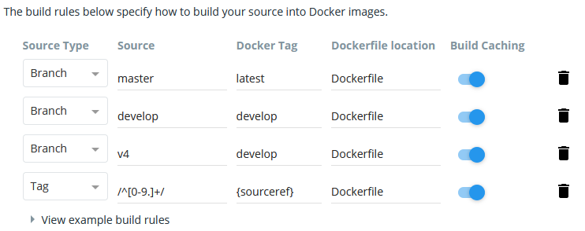

# Docker-Multiarch
Modèle pour des images docker Multiarch

## Comment ça marche ?
Grâce à l'autobuild de Docker Hub.

Le dépôt GitHub doit être en lien avec Docker Hub.
L'auto-build peut être activé ou non.

La gestion des tags et des manifestes est automatique.

## Exemples de configuration

> NOTE: 
> Vous n'êtes pas obligé de créer toutes ces règles.
> Elles ne sont là que pour détailler le fonctionnement

### Règle 1
Si la branche est "master", nous n'utilisons pas le "Docker Tag"
Les images seront tagué => IMAGE:ARCH-COMMITID
Le manifeste regroupant les images sera tagué => IMAGE:MASTER

### Règle 2 / Règle 3
Si vous voulez créer des images depuis d'autres branches que master.
Le "Docker Tag" doit être égal à **develop** pour obtenir le résultat suivant :
Les images seront tagué => IMAGE:ARCH-COMMITID
Le manifeste regroupant les images sera tagué => IMAGE:SOURCE_BRANCH

> **ATTENTION**
> Si vous entrez un autre "Docker Tag" que **develop**
> Les images seront tagué => IMAGE:DOCKER_TAG
> Le manifeste sera tagué => IMAGE:latest

### Règle 4
Lors de la création d'un TAG, d'une RELEASE sur votre dépôt GitHub
Les images seront tagué => IMAGE:ARCH-x.x.x
Le manifeste regroupant les images sera tagué => IMAGE:latest
